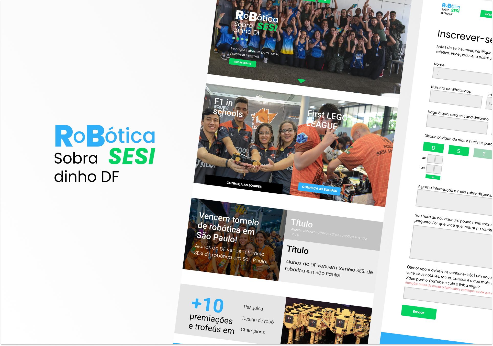

<h2 align="center">🤖 Welcome to Robotic's World</h2>

  <a href="#CAP1 - O PROBLEMA"> 1 - O problema </a>
  <a href="#CAP2 - O PROBLEMA"> 2 - A interface</a>

 
<h4 align="center">
 📌 Project status: Finished🔨
</h4> 
<h4 align="center">
  <a href="https://www.figma.com/file/NvxG3VtXffKeZLrruVGzcn/PHPRoboticaWebSite?node-id=123%3A4">Check the interface design at Figma</a>
</h4> 
    

> ## CAP1 - The Problem
> 
The Robotic's project has been in place for 6 years at SESI DF schools in the region. Inside it, students are engaged to building robots, carrying out research projects and even building miniature formula 1 cars.  
> However, the enrollment process for students interested in joining the teams is not automated and depends on external servers. Considering this problem and understanding that teams also need a means of advertising to acquire sponsorships, the Robotics SESI website was created as a possible solution.

> ## CAP2 - Features
> - [x] Subscription of interesteds

