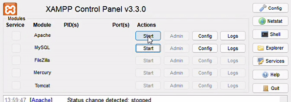
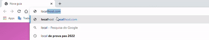

<h2 align="center">🤖 Welcome to Robotic's World</h2>
<h3 align="center" >
  <a href="#the-problem">The Problem</a>  •
  <a href="#start-project">Start on your machine</a>  •
  <a href="#features">Features</a>
</h4> 
<br>
<h4 align="center">
 🚧⚠️ Project status: Developing🔨
</h4> 
<h4 align="center">
  ❗Check the deploy prototype on: <a href="https://suyannesara.github.io/RoboticsWebSite/">https://suyannesara.github.io/RoboticsWebSite/</a>
</h4>
<h4 align="center">
  <a href="https://www.figma.com/file/NvxG3VtXffKeZLrruVGzcn/PHPRoboticaWebSite?node-id=123%3A4">Check the interface design on Figma</a>
</h4><br>
 <br> <br>


<h2 align="center" id="the-problem">CAP1 - The Problem</h2>

> <h4>The Robotic's project has been runnig since 2016 at SESI DF schools in the region. Inside it, students are engaged to build robots, carry out research projects and even build miniatures of formula 1 cars. <br>
> However, the enrollment process for students interested in joining the teams is not automated and depends on external servers. Considering this problem and understanding that teams also need a way of advertising to acquire sponsorships, the Robotics SESI website was created as a possible solution.</h4> 
<br>

<h2 align="center" id="start-project">CAP2 - How to start this project on your machine</h2>
  1. Install <a href="https://www.apachefriends.org/pt_br/index.html">XAMP</a> on your machine <br>
  2. Open XAMP on your PC and start MySQL and Apache <br> 
  
  <br>
  3. Clone this repository

  ```bash 
  $git clone https://github.com/Suyannesara/RoboticsWebSite.git 
  ```
  <br>
4. Insert all folders and files of the cloned repository into: ../xammp/htdocs <br>
5. Type "localhost" on your browser <br> 
    
<br>

<h2 align="center" id="features">CAP3 - Features</h2>

- [x] Registration of interested parties
- [x] Advertising about championships modalities
- [ ] Specific page to meet each team
- [ ] Javascript news animation, and picture carrousel

<br>
<h2 align="center">👩🏻Thanks for reading, hope you like it!</h2> <br>
<p align="center">
  <a target="_blank" href="https://www.linkedin.com/in/suyanne-miranda/"> </a> 
  <a target="_blank" href="https://stackoverflow.com/users/17331573/suyanne-miranda"> </a> 
  <a target="_blank" href="https://www.behance.net/suyannesara">  <br></a>
  <small>May the coffee be with you  </small> 
</p>


